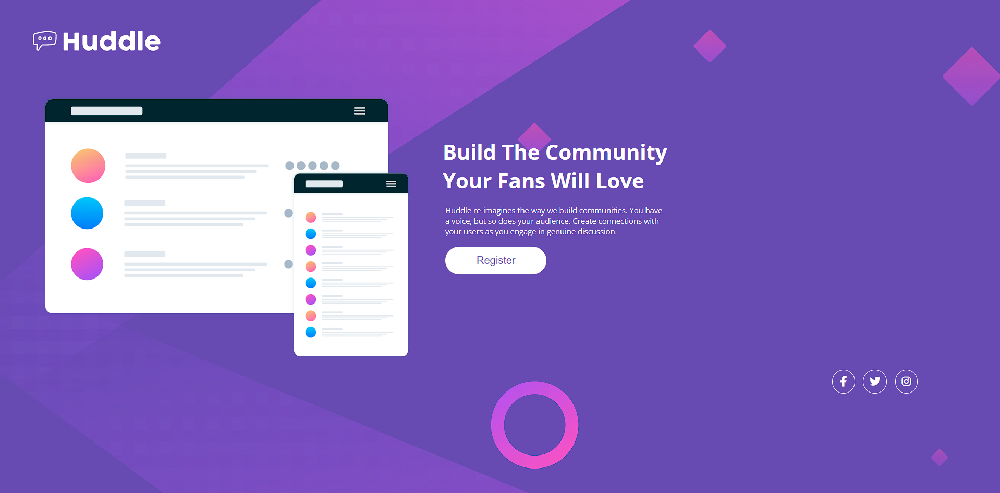

<h1 align="center">Projeto Quest #01</h1>

  

## Sobre
- Projeto que simula um site feito para registrar usuarios de uma rede social 

## Tecnologias Utilizadas 
- HTML 
- CSS

## Responsividade
- Para todos os tipos de dispositivos.
- Decidi ir um pouco além do que foi pedido na quest e fiz responsividade para outros tamanhos de dispositivo também

